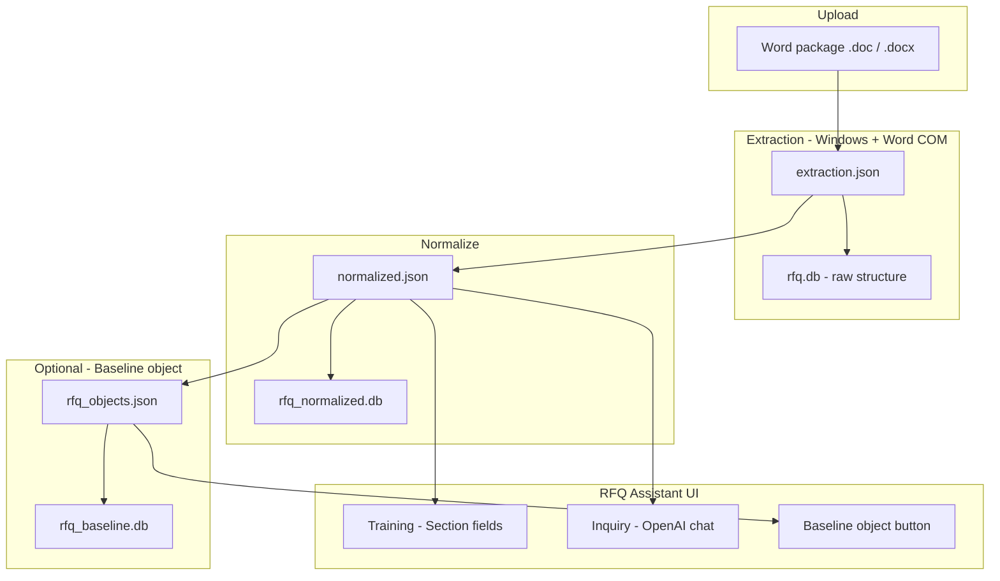

# RFQ extraction data model

This document explains how uploaded Word RFQ packages are stored, how new fields and sections are handled, and how the different output files relate to each other.

It applies to the **Word extraction** path (Knowledge Base → **Training**), not the legacy Excel workbook upload or the demo SQL seed pack under `project_files/`.

---

## Summary

The extraction pipeline uses a **document-centric, schema-on-read** design:

1. **Capture everything** from each Word package (text, attachments, sections).
2. **Discover fields dynamically** at extraction time (`Label: value` heuristics).
3. **Store flexible JSON** per section — no database migration when GM adds a new form label.
4. **Optionally map** known fields to a **canonical baseline catalog** for standardized comparison.

In industry terms this is also described as:

- **Schema-on-read** (structure inferred when documents are processed, not fixed upfront)
- **Semi-structured / weakly structured form extraction**
- **Raw + curated dual model** (flexible normalized layer, optional canonical baseline layer)
- **Section-scoped EAV** (entity–attribute–value, grouped by RFQ section rather than one global key/value table)

This pattern is common in RFQ/RFP, invoice, contract, and other document-heavy systems where templates change and every upload may differ slightly.

---

## End-to-end flow



**Typical operator path:** upload → **Run extraction** → keep **Normalize** checked → review in **Training** → query in **Inquiry**.

Output files live under `word-extract/output/` by default (override with `RFQ_OUTPUT_DIR`).

---

## The three storage layers

### 1. Raw extraction (`extraction.json`, `rfq.db`)

**Purpose:** Preserve the full structural extract from Word — paragraphs, tables, embedded attachments, PDF text, Excel sheet data.

**Schema:** Structural, not field-name driven. New content becomes new rows (documents, attachments, paragraphs).

| Artifact | Location | Role |
|----------|----------|------|
| `extraction.json` | `word-extract/output/` | Manifest of all packages and nested files |
| `rfq.db` | `word-extract/output/` | SQLite index of raw documents, tables, attachments |

**Code:** `word-extract/load_db.py`, `word-extract/extract_rfq.py`

**New fields:** N/A at this layer — it stores text and structure, not business field names.

---

### 2. Normalized layer (`normalized.json`, `rfq_normalized.db`) — primary path

**Purpose:** Comparison-ready, human-readable packages for Training, Inquiry, and cross-RFQ diff.

**Schema:** **Flexible.** Each upload is a `NormalizedPackage` with a `section_slots[]` array. Each slot holds a dynamic `fields[]` list of `{ field, value }` pairs.

| Artifact | Location | Role |
|----------|----------|------|
| `normalized.json` | `word-extract/output/` | Source of truth for UI and Inquiry |
| `rfq_normalized.db` | `word-extract/output/` | SQLite mirror; full slot stored as JSON in `slot_json` |

**Key tables in `rfq_normalized.db`:**

| Table | Contents |
|-------|----------|
| `rfq_packages` | One row per uploaded Word file |
| `rfq_sections` | Section headings parsed from the document |
| `rfq_documents` | Nested Word files with `clean_text` |
| `rfq_attachments` | Embedded PDF/Excel/Word with metadata |
| `rfq_section_slots` | **Per-section slot** — `body_text`, `status`, and **`slot_json`** (includes `fields[]`) |
| `rfq_chunks` | Text chunks for search / RAG-style use |

**Code:**

| Area | File |
|------|------|
| Field parsing | `word-extract/extractors/field_parser.py` |
| Section slots | `word-extract/extractors/section_slots.py` |
| Normalize pipeline | `word-extract/extractors/normalize.py`, `word-extract/normalize_rfq.py` |
| TypeScript types | `src/lib/extraction/normalizedTypes.ts` |
| UI | `src/components/extraction/NormalizedCleanView.tsx` |
| Inquiry context | `src/lib/rfq/kbInquiryContext.ts`, `src/lib/rfq/kbInquiryCompare.ts` |

**How new sections are handled:**

- Sections come from **Word headings** plus **inline attachment icon mappings**.
- `_merged_section_catalog()` unions parsed headings and mapped sections (e.g. `0.1`, `1.3`).
- A new section in the document (e.g. `1.5`) becomes a new `section_slot` automatically.

**How new field names are handled:**

- `parse_fields_from_text()` scans for lines matching `Label: value`.
- `parse_fields_from_excel()` uses a label/value heuristic on Excel grids.
- `build_section_fields()` merges metadata, attachment status, and parsed form fields per section.
- Duplicate field names (case-insensitive) within a section are deduplicated.
- **No SQL migration** — new labels are appended to the `fields[]` array inside `slot_json`.

---

### 3. Baseline / RFQ object layer (`rfq_objects.json`, `rfq_baseline.db`) — optional

**Purpose:** Map GM template fields to **stable canonical keys** (`field_key`) for baseline comparison and procurement intelligence templates.

**Schema:** **Curated (schema-on-write).** Fields are defined in `FIELD_CATALOG` and extracted via known form regexes.

| Artifact | Location | Role |
|----------|----------|------|
| `rfq_objects.json` | `word-extract/output/` | JSON array of RFQ objects with `fields[]` and provenance |
| `rfq_baseline.db` | `word-extract/output/` | SQLite: `rfq_object_packages`, `rfq_object_fields` |

**Code:**

| Area | File |
|------|------|
| Field catalog | `word-extract/extractors/baseline_catalog.py` |
| Object builder | `word-extract/extractors/rfq_object_builder.py` |
| SQLite load | `word-extract/rfq_object_db.py` |
| API | `src/app/api/baseline/build/route.ts` |

**How new field names are handled:**

- Known forms (Quote Acknowledgement, Supplier Request Form, etc.) map to fixed keys like `form.supplier_request.supplier_name`.
- `_merge_catalog_placeholders()` ensures every catalog field exists (blank if not extracted).
- **Unknown new labels** remain in the normalized layer only until you extend `FIELD_CATALOG` and/or `rfq_object_builder.py`.

**Trigger:** **Baseline object** button in the app header (or `POST /api/baseline/build`).

---

## Concrete example: `rfq1.doc` vs `rfq2.doc`

Suppose both packages have section **1.3 Supplier Request Form**, but:

| File | Supplier Name | Sustainability Tier |
|------|---------------|---------------------|
| `rfq1.doc` | blank (`_____`) | not present |
| `rfq2.doc` | `TEST` | `Tier 2` |

### After extraction and normalize

`rfq2.doc` section `1.3` in `normalized.json` (simplified):

```json
{
  "section_number": "1.3",
  "section_display": "1.3 Supplier Request Form",
  "status": "complete",
  "fields": [
    { "field": "section_number", "value": "1.3" },
    { "field": "section_title", "value": "1.3 Supplier Request Form" },
    { "field": "status", "value": "complete" },
    { "field": "Supplier Name", "value": "TEST" },
    { "field": "Currency", "value": "USD" },
    { "field": "Sustainability Tier", "value": "Tier 2" }
  ],
  "expected_files": [
    {
      "icon_label": "Supplier Request Form.doc",
      "present": true,
      "document_role": "supplier_request_form",
      "clean_text": "Supplier Name: TEST\n…\nSustainability Tier: Tier 2"
    }
  ]
}
```

`rfq1.doc` would have the same structure but `Supplier Name` empty and **no** `Sustainability Tier` row.

### In the UI

**Training → Section fields** renders each slot’s `fields[]` as a two-column table (Field / Value).

### In Inquiry

When comparing RFQs, `kbInquiryCompare.ts` builds a per-package digest:

- Labels packages **RFQ1**, **RFQ2**, … (sorted by `package_id`)
- Filters out blank values and underscore placeholders (`_____`)
- Highlights `supplier_and_commercial_sections` for form diffs

The model can answer: RFQ2 has `Supplier Name: TEST` and an extra field `Sustainability Tier: Tier 2` that RFQ1 lacks — without any schema change.

### In baseline object

`Supplier Name` maps to `form.supplier_request.supplier_name` via regex in `rfq_object_builder.py`.

`Sustainability Tier` would **not** appear in the baseline object until added to `FIELD_CATALOG` and an extractor rule.

---

## What is *not* the Word extraction database

The SQL file `project_files/RFQ_Agent_Test_Files_Pack/database/01_schema.sql` is a **demo analytics schema** (`rfq_projects`, `quote_submissions`, `rule_hits`, etc.) for historical RFQ samples and gap analysis. It uses **fixed columns** and is separate from the Word extraction output under `word-extract/output/`.

| Store | Fixed schema? | Used for |
|-------|---------------|----------|
| `word-extract/output/normalized.json` | No | Training, Inquiry, multi-RFQ compare |
| `word-extract/output/rfq_normalized.db` | No (JSON slots) | SQLite queries, rebuild from JSON |
| `word-extract/output/rfq_baseline.db` | Yes (catalog) | Canonical GM field comparison |
| `01_schema.sql` demo DB | Yes | KB historical samples, rules engine demos |

---

## When a field might be missed

The normalized layer only captures fields the parser recognizes:

| Pattern | Detected? |
|---------|-----------|
| `Supplier Name: TEST` on its own line | Yes |
| Excel: label in column A, value in column B | Yes |
| Label in a Word table cell without `:` | Often no |
| Checkboxes only | Often no |
| Unusual spacing or multi-line labels | Maybe |

Missed content may still appear under **Raw by section** (`clean_text`) even if it is absent from `fields[]`.

**Fix:** extend `word-extract/extractors/field_parser.py` (or add form-specific rules in `rfq_object_builder.py`). Still no DB migration required.

---

## Extending the system for new GM fields

| Goal | Action |
|------|--------|
| Show new label in Training / Inquiry | Usually automatic if `Label: value` format; otherwise improve `field_parser.py` |
| Stable key for reporting / baseline | Add entry to `FIELD_CATALOG` in `baseline_catalog.py` |
| Extract from a specific attachment | Add regex mapping in `rfq_object_builder.py` `_extract_form_fields()` |
| New section mapping | Usually automatic from headings; verify inline icon mapping in `section_parser.py` |

After code changes: re-run **Run extraction** and **Normalize** on affected packages (or full re-upload).

---

## Multi-RFQ uploads and display names

- Multiple Word packages can coexist in `extraction.json` / `normalized.json` (append mode by default).
- Each package has a `package_id` (UUID stem from upload filename).
- Human-readable names (`rfq1.doc`, `rfq2.doc`) are stored via `uploads/index.json` and shown in the Training sidebar.
- Delete per package: sidebar trash icon or **Delete RFQ** in the extracted packages card (`DELETE /api/extraction/package`).

---

## Comparison to other approaches

| Approach | Pros | Cons |
|----------|------|------|
| **This design (schema-on-read + optional catalog)** | Handles template drift; no migration per new field; fast heuristic parse | Weaker on odd layouts; baseline needs manual catalog updates |
| Fixed SQL schema (`01_schema.sql` style) | Simple reporting | Breaks when GM adds fields |
| Template-per-form | High accuracy for known layouts | Brittle when templates change |
| LLM-only extraction | Very flexible | Cost, latency, needs validation guardrails |

**Evolution path (common in industry):** keep the flexible normalized layer; promote frequently seen new fields into the baseline catalog and stronger parsers over time.

---

## File reference

| Path | Description |
|------|-------------|
| `word-extract/output/extraction.json` | Raw extraction manifest |
| `word-extract/output/normalized.json` | Normalized packages (UI + Inquiry) |
| `word-extract/output/rfq.db` | Raw extraction SQLite |
| `word-extract/output/rfq_normalized.db` | Normalized SQLite |
| `word-extract/output/rfq_objects.json` | Baseline RFQ objects |
| `word-extract/output/rfq_baseline.db` | Baseline SQLite |
| `word-extract/uploads/index.json` | Original upload filenames by package id |
| `docs/ec2-word-extraction.md` | Deploying extraction on Windows EC2 |

Environment variables: `RFQ_ENGINE_ROOT`, `RFQ_OUTPUT_DIR`, `RFQ_UPLOADS_DIR` (see `src/lib/extraction/enginePaths.ts`).

---

## Related UI surfaces

| Surface | Data source |
|---------|-------------|
| Training → **Section fields** | `normalized.json` → `section_slots[].fields[]` |
| Training → **Raw by section** | `extraction.json` / browse API |
| Inquiry chat | `normalized.json` (comparison digests when multiple packages) |
| **Baseline object** | `rfq_objects.json` / `rfq_baseline.db` |
| Header stats (sections, files) | `extraction.json` manifest |

---

## Glossary

| Term | Meaning in this app |
|------|---------------------|
| **Package** | One uploaded Word RFQ file (`.doc` / `.docx`) |
| **Section slot** | One RFQ section (e.g. `1.3`) with body text, attachments, and parsed fields |
| **Field** | A `{ field, value }` pair discovered from form text or metadata |
| **Normalize** | Python step that builds `normalized.json` and `rfq_normalized.db` from `extraction.json` |
| **Baseline object** | Curated RFQ with canonical `field_key`s from `FIELD_CATALOG` |
| **Schema-on-read** | Field names are inferred at extract time, not predefined in SQL columns |
